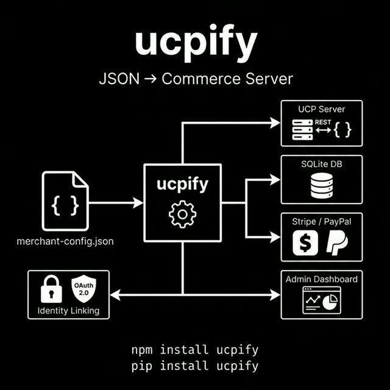
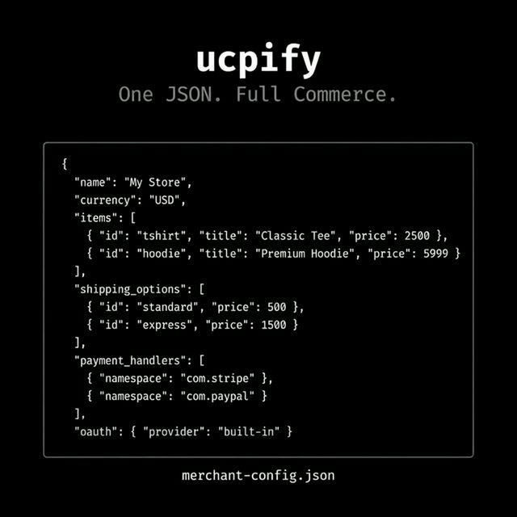

# ucpify

Turn a JSON file into a working commerce server.

You have products. Maybe in a spreadsheet, maybe in a config file. You want to sell them online without building a full backend from scratch. ucpify takes a single `merchant-config.json` and gives you a [UCP](https://ucp.dev)-compliant commerce API with payments, persistence, and OAuth wired in.

Node.js and Python. Same config, same behavior.



## Get started

```bash
npm install ucpify        # or: pip install ucpify
npx ucpify init           # generates a sample config
npx ucpify serve merchant-config.json
```

That's it. Server is running.

## The config

Everything is declared in one file:



```json
{
  "name": "My Store",
  "domain": "https://mystore.com",
  "currency": "USD",
  "tax_rate": 0.08,
  "items": [
    { "id": "tshirt", "title": "Classic Tee", "price": 2500 },
    { "id": "hoodie", "title": "Premium Hoodie", "price": 5999 }
  ],
  "shipping_options": [
    { "id": "standard", "title": "Standard Shipping", "price": 500 },
    { "id": "express", "title": "Express Shipping", "price": 1500 }
  ],
  "payment_handlers": [
    { "namespace": "com.stripe", "id": "stripe_handler" },
    { "namespace": "com.paypal", "id": "paypal_handler" }
  ],
  "oauth": { "provider": "built-in" }
}
```

Products, shipping, payments, auth. No code to write.

## What you get


13 endpoints covering the full checkout lifecycle and OAuth:

| Method | Path | What it does |
|--------|------|--------------|
| `GET` | `/.well-known/ucp` | UCP discovery |
| `POST` | `/ucp/v1/checkout-sessions` | Create checkout |
| `GET` | `/ucp/v1/checkout-sessions/:id` | Get session |
| `PUT` | `/ucp/v1/checkout-sessions/:id` | Update session |
| `POST` | `.../complete` | Complete checkout |
| `POST` | `.../cancel` | Cancel checkout |
| `GET` | `/ucp/v1/orders` | List orders |
| `GET` | `/ucp/v1/orders/:id` | Get order |
| `GET` | `/ucp/v1/items` | Product catalog |
| `GET` | `/.well-known/oauth-authorization-server` | OAuth metadata |
| `GET` | `/oauth2/authorize` | Consent screen |
| `POST` | `/oauth2/token` | Token exchange |
| `POST` | `/oauth2/revoke` | Token revocation |

Plus `/health` and `/admin` for monitoring.

## Identity linking

UCP uses OAuth 2.0 so AI agents can act on behalf of users without sharing credentials. ucpify supports a built-in OAuth server or an external provider:

```json
{ "oauth": { "provider": "built-in" } }
```

```json
{ "oauth": { "provider": "external", "issuer": "https://...", "authorization_endpoint": "https://...", "token_endpoint": "https://..." } }
```

Register a client:

```bash
npx ucpify oauth:add-client merchant-config.json --name "My Agent" --redirect-uri "http://localhost:8080/callback"
```

Supports Authorization Code with PKCE, token refresh, revocation, and Bearer middleware on all `/ucp/v1/*` routes.

## What's included

- Stripe and PayPal payment processing, webhooks included
- OAuth 2.0 identity linking, built-in or external
- SQLite with WAL mode, proper schemas, indexes
- Input validation and rate limiting
- Admin dashboard and health checks
- Works in Docker

## Environment variables

```bash
STRIPE_SECRET_KEY=sk_...
STRIPE_WEBHOOK_SECRET=whsec_...
PAYPAL_CLIENT_ID=...
PAYPAL_CLIENT_SECRET=...
```

## CLI

```bash
ucpify init                          # sample config
ucpify validate config.json          # check your config
ucpify serve config.json             # start server
ucpify serve config.json --no-db     # in-memory mode
ucpify oauth:add-client config.json  # register OAuth client
```

## Links

[npm](https://www.npmjs.com/package/ucpify) · [PyPI](https://pypi.org/project/ucpify/) · [GitHub](https://github.com/hemanth/ucpify) · [UCP spec](https://ucp.dev)

## License

MIT
